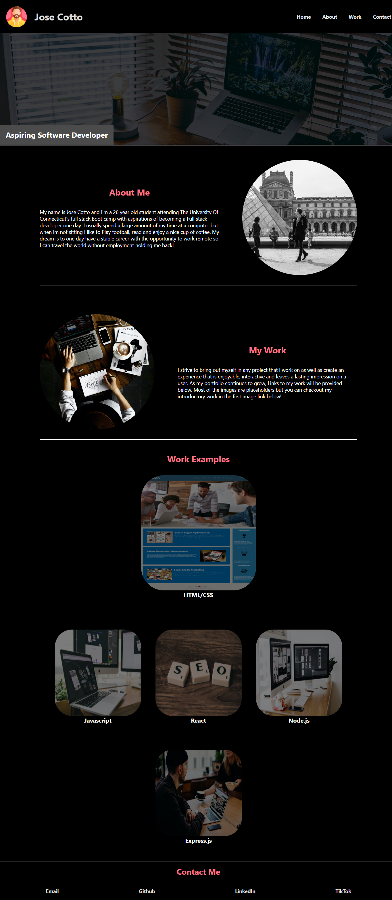

# Module-2 Portfolio challenge

## Description

This webpage was created to provide a central place where I can store my most recent work and highlight projects for potential employers. This project strengthened my skills in Flexbox and media queries and I learned the importance of spacing and layout when making a webpage responsive. 

## Table of Contents 

- [Installation](#installation)
- [Usage](#usage)
- [Credits](#credits)
- [License](#license)

## Installation

N/A

## Usage

To use this webpage you can review the information in each section by using the links in the nav bar. If there is a project your interested in, click the image link to bring you to the desired project. If you would like to visit my portfolio page use the link below!

## Credits

Photos in the project were obtained from (https://www.pexels.com/)

avatar for the project was obtained from (https://www.flaticon.com/free-icons/avatar)

## License

N/A

